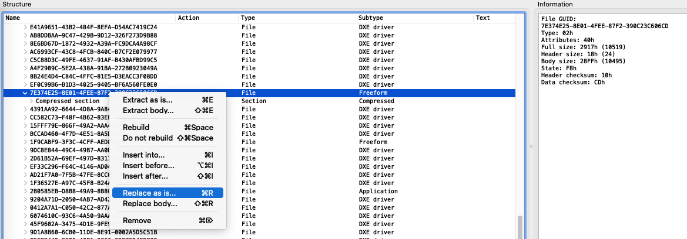

# iMac 12,x 64bit PCIe address space enabler (aka UEFI Windows audio ACPI patch)

This patch modifies firmware ACPI tables to enable 64bit PCIe address space. This fixes the well known UEFI Windows audio driver error, as well as other potential driver issues in UEFI Windows.  
After applying this patch OpenCore is no longer needed to make Windows High Definition Audio Driver work in windows.

## How it works

Firmware volume `7E374E25-8E01-4FEE-87F2-390C23C606CD` holds a Tiano compressed blob of firmware ACPI tables. The ACPI tables are stored one after each other with a 4 bytes header prefix on each table.  
This patch modifies the main DSDT table to allow the use of a 64-bit PCIe address space. DSDT modification is done according to [this post](https://forums.macrumors.com/threads/can-i-use-opencore-with-stock-2011-imac-gpu-to-fix-windows-10-uefi-audio.2273356/post-29347582) by [Pascal Baillargeau](https://forums.macrumors.com/members/pascal-baillargeau.1167973/).  
Original and modified DSDT tables in DSL and AML format are included for information purposes.

## How to apply patch

To apply patch use `UEFITool 0.28`.  
Load your previously backed up firmware file and right-click to replace "as is" volume with guid `7E374E25-8E01-4FEE-87F2-390C23C606CD` with the .ffs file found on the folder corresponding to your iMac model.

After replacing volume, select "Save image file..." to obtain the pathched firmware file that you can program to the eeprom.

## Notes

- Tested on iMac 12,x with bootrom 87.0.0.0.0.
- Same kind of patch should work for other Sandy Bridge and Ivy Bridge Macs but, since ACPI tables are platform dependent, you will need to mod the DSDT file specific for you model. You can also send me you firmware file and I'll make the patch and add it to this repository.