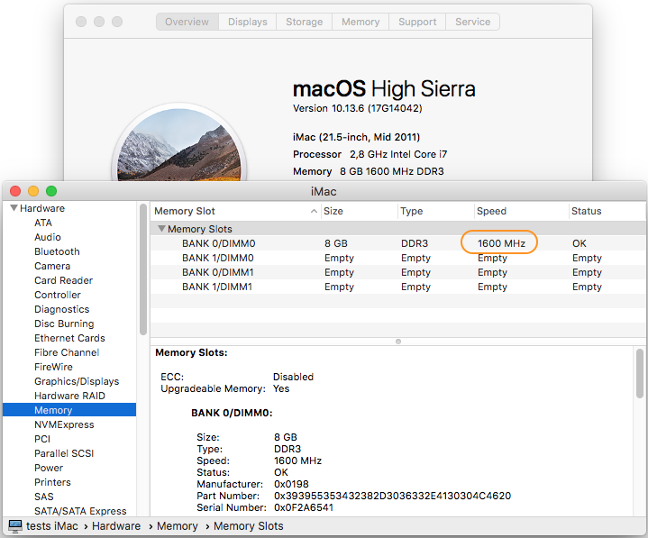

# iMac 12,x DDR3 Frequency Limit disable

Removes the 1333 MHz frequency limit Apple hardcoded in bios settings.  
Faster DDR3 modules work on iMac, but were limited to 1333 MHz speed.  
This patch removes such limit, allowing the use of 1600/1867/2133 MHz compatible modules at full speed.



## How it works

Patches PEI module PlatformStage1Pei to force `SaPlatformPolicyPpi->MemConfig->DdrFreqLimit = 0`  
Effect is the same as selecting "Auto" or "Disabled" in other vendors bios setting "DDR Frequency Limit".

## How to apply patch

Patch can be applied to your previously backed up eeprom using ``UEFIPatch``:

```
UEFIPatch my_bios.img ddr3-freq-limit-disable.txt -o new_bios.img
```

After applying it, program ``new_bios.img`` back to eeprom chip.   

## Notes

- Tested on iMac 12,x with bootrom 87.0.0.0.0.
- Not all ram modules tested seem to work. If they do not work at 1333 MHz for a start, they will probably not work at higher speeds.
- The "sweet spot" for Sandy Bridge seems 1600 MHz. Faster modules may bring little performance increase.
- Some 1867/2133 MHz memory modules fail to boot when frequency limit is removed, but work fine with a 1600 MHz limit. Added patch to limit DDR3 frequency to 1600 MHz.
