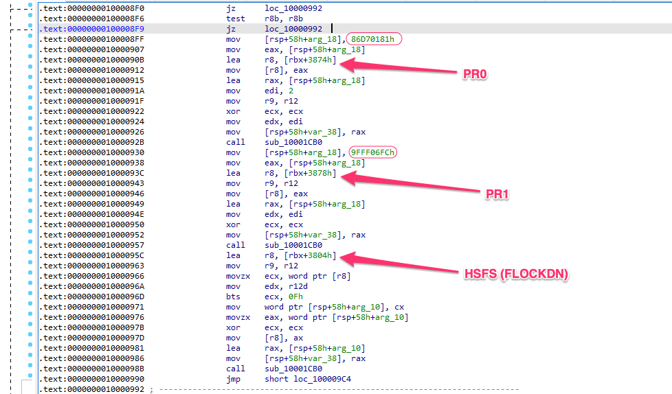

# iMac 12,x flash protection bypass

One of the most painful tasks of firmware modding is having to open the iMac and clip the eeprom chip to program it for every test.
This patch enables full software write access to the eeprom, so it can be programmed from OS or UEFI shell.

## How it works

Apple bios uses the PR (Protected Range) registers to define non-writeable flash ranges.

We can check the flash layout using `ifdtool`:

```
00000000:00000fff fd
00181000:007fffff bios  
00001000:00180fff me
```

And the flash protection using `chipsec`:

```
[*] running module: chipsec.modules.common.bios_wp
[x][ =======================================================================
[x][ Module: BIOS Region Write Protection
[x][ =======================================================================
[*] BC = 0x00 << BIOS Control (b:d.f 00:31.0 + 0xDC)
    [00] BIOSWE           = 0 << BIOS Write Enable
    [01] BLE              = 0 << BIOS Lock Enable
    [02] SRC              = 0 << SPI Read Configuration
    [04] TSS              = 0 << Top Swap Status
    [05] SMM_BWP          = 0 << SMM BIOS Write Protection
[-] BIOS region write protection is disabled!

[*] BIOS Region: Base = 0x00181000, Limit = 0x007FFFFF
SPI Protected Ranges
------------------------------------------------------------
PRx (offset) | Value    | Base     | Limit    | WP? | RP?
------------------------------------------------------------
PR0 (74)     | 86D70181 | 00181000 | 006D7FFF | 1   | 0
PR1 (78)     | 9FFF06FC | 006FC000 | 01FFFFFF | 1   | 0
PR2 (7C)     | 00000000 | 00000000 | 00000000 | 0   | 0
PR3 (80)     | 00000000 | 00000000 | 00000000 | 0   | 0
PR4 (84)     | 00000000 | 00000000 | 00000000 | 0   | 0

[!] SPI protected ranges write-protect parts of BIOS region (other parts of BIOS can be modified)
```

Here we see all of the bios flash region is write protected except a "hole" in the middle corresponding to the EfiSystemNvDataFvGuid volume (where nvram storage is located).
Strangely (Apple bug?) the flash descriptor and ME areas are not protected on cold boot.

Also, the PR registers are protected against modification by the Flash Configuration Lock-Down (FLOCKDN) bit in the HSFS register. Once set, FLOCKDN can only be cleared by a cpu reset (reboot or sleep/wake).

With a bit of reversing, we can find how this protections mechanisms are setup during boot on UEFI module PchSpiRuntime:



This patch will remove PRR and FLOCKDN protection by skipping the protection setup code. As a result PR registers are set to 0 and the FLOCKDN flag is letf unset. 

Same protection mechanism is widely used by Apple on most old Intel Macs so, if this exact patch does not work on yours, an easy adaptation can be made by disassembling the PchSpiRuntime UEFI module, finding where PR0 and PR1 are set and changing their values to 0.

## How to apply patch


Patch can be applied to your previously backed up eeprom using ``UEFIPatch``:

```
UEFIPatch my_bios.img flash-protection-bypass.txt -o new_bios.img
```

After applying it, program ``new_bios.img`` back to eeprom chip with a hardware programmer like CH341A + SOIC clip. 

Keep in mind to use the patched rom as a base for all future modding (or you will re-protect it).

Once unprotected you should be able to use any compatible software flash programming tool to program it in the future (flashrom, Intel FPT). One good choice is GRML linux + flashrom. Software programming the eeprom takes 15 seconds, while using a clip takes around 6 minutes.

## Notes

- Tested on iMac 12,x with bootrom 87.0.0.0.0. May work on other Mac models and versions. If you try it watch UEFIPatch output for clues.
- After a sleep/wake cycle the eeprom will be protected again. This is due to some S3 wake security patches by Apple. If you want to flash you eeprom, do it after a cold boot or restart.
- Some 2010 iMacs (maybe other models too) have SST eeprom chips that can be very hard to program with a CH341A + clip, requiring several passes to read or write correctly. Take that into account if you find one of them.
- If you brick your iMac due to further changes you make to the bios, you will of course need the clip to recover, but for simple "low risk of brick" modding and testing, this is huge time saver.


## Warning

Intended audience is people experimenting with bios firmware mods. Always make a full backup of you eeprom first and make sure you have the required skills/experience to program the eeprom with a clip and hardware programmer.

**PROCEED AT YOUR OWN RISK!**
